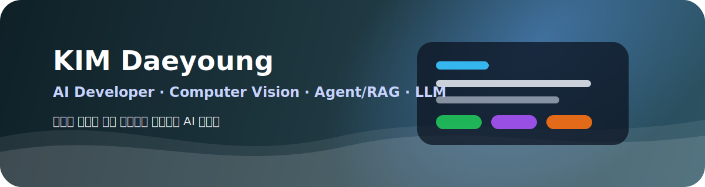
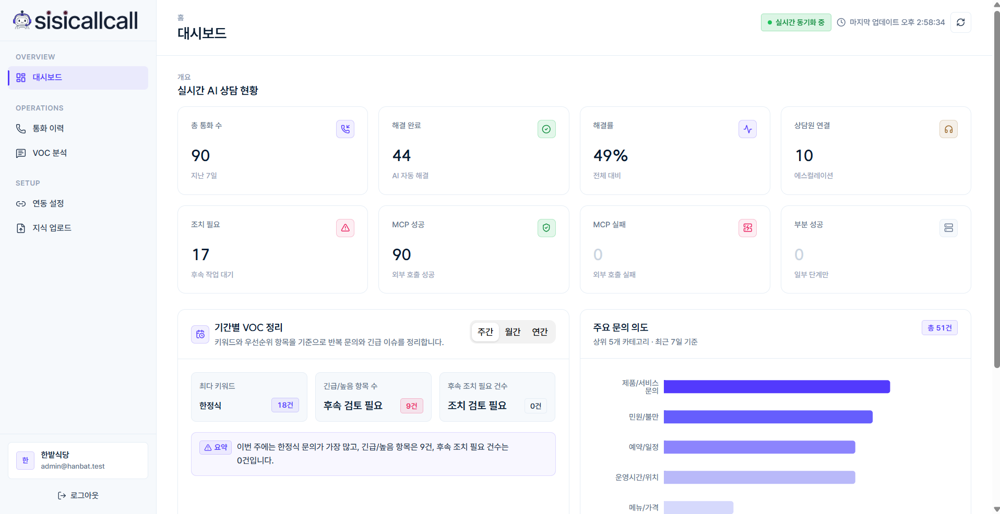
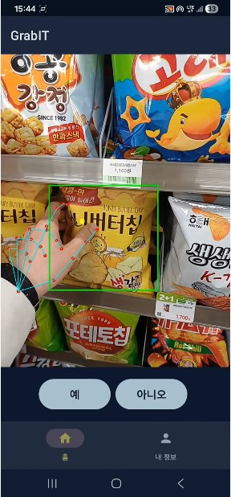

  

<h3 align="center">AI Developer · Computer Vision · Agent/RAG · LLM</h3>

  사용자 문제를 AI 모델, 백엔드, 데이터 파이프라인, 외부 도구 연동까지 연결해 실제 서비스로 구현하는 개발자입니다.

  
  
  

 

## About Me

- Computer Vision을 중심으로 AI 서비스를 설계하고 구현해왔습니다.
- 최근에는 Agent/RAG, LLM 기반 워크플로우, 음성 AI, Post-Call 자동화까지 확장하고 있습니다.
- 단순 모델 구현보다, 실제 사용자 문제를 해결하는 제품 흐름과 운영 가능한 시스템 구조에 관심이 많습니다.
- AI 모델, 데이터베이스, 백엔드 API, 대시보드, 외부 도구 연동을 함께 고려하는 풀스택형 AI 개발을 지향합니다.

 

## 🛠 Tech Stack

### 💻 Languages

### 🤖 AI / ML

### 🧩 Agent / Workflow

### 🎨 Frontend

### ⚙️ Backend

### 🗄 Database / Infra

### 📱 Mobile

### 🧰 Tools / Integration

 

## Featured Projects

  
<h2>☎️ 시시콜콜 — AI 음성 고객상담 운영 플랫폼</h2>

   

  

    
  

  

    
  

  전화를 받고, 이해하고, 요약하고, 분석하고, 후속 업무까지 실행하는 AI 음성 고객상담 B2B SaaS 플랫폼입니다.  
  실시간 통화 Agent와 Post-Call Agent를 분리해 전화 응대, 문서 기반 FAQ 답변, 통화 요약, VOC 분석, 외부 업무 도구 자동 등록까지 하나의 흐름으로 연결했습니다.

   

  <b>My Role</b> 
  - 화자검증 모델 파인튜닝 및 전화망 환경 도메인 적응 실험
  - Post-Call Agent 설계 및 구현
  - 통화 요약, VOC 분석, 우선순위 판단, 후속 액션 제안 흐름 설계
  - Planner / Reviewer Agent 기반 검증 루프 설계
  - 프론트 대시보드 설계 및 배포

    
  <b>Core Features</b> 
  - Twilio 기반 실시간 전화 스트림 처리
  - VAD → STT → LangGraph Call Agent → TTS 응답 파이프라인
  - PDF 매뉴얼 기반 RAG FAQ 응답
  - 통화 종료 후 요약, VOC, priority 자동 분석
  - Slack, Jira, Notion, Calendar 등 외부 도구 연동 자동화

    
  <b>Tech</b> 
   ·  ·  ·  ·  ·  ·  · 

    
  <b>Repository</b> 
  - <a href="https://github.com/Of-Calls/sisicallcall">Of-Calls/sisicallcall</a>

 

  
<h2>📱 GrabIT — 시각장애인을 위한 온디바이스 AI 쇼핑 도우미</h2>

   

  

    
    
  

  시각장애인 및 저시력자가 매장 진열대 앞에서 원하는 상품을 더 쉽게 찾을 수 있도록 돕는 온디바이스 AI 기반 Android 애플리케이션입니다.  
  카메라로 상품을 인식하고, 손가락 위치를 추적하며, 음성 안내와 비프음 피드백을 통해 화면을 보기 어려운 상황에서도 목표 상품의 위치를 직관적으로 안내하는 데 초점을 맞췄습니다.

   

  <b>Core Features</b> 
  - YOLOX-Nano 모델을 TensorFlow Lite로 변환해 모바일 기기 내에서 상품을 실시간 인식
  - MediaPipe Hands로 손가락 끝 좌표를 추적하고 상품 박스와의 거리 기반 안내 제공
  - STT / TTS 기반 음성 제어와 음성 피드백 흐름 구현
  - 목표 상품과 손 위치가 가까워질수록 비프음 주기를 조절하는 접근성 피드백 설계
  - Room Database 기반 최근 검색 기록 저장
  - Node.js / FastAPI 기반 유사어 검색 및 상품 규격 정보 API 연동
  - E5 임베딩 기반 자연어 유사어 검색으로 사용자의 구어체 표현을 상품명과 매칭

    
  <b>Tech</b> 
   ·  ·  ·  ·  ·  ·  ·  · 

    
  <b>Repository</b> 
  - <a href="https://github.com/KDT-GrabIT/GrabIT-Android">GrabIT-Android</a> 
  - <a href="https://github.com/KDT-GrabIT/Grabitwebsite">Grabitwebsite</a>

 

  
<h2>🧠 UniGen — 세대 간 소셜 네트워크 플랫폼</h2>

   

  

    
  

  일반 사용자와 시니어 사용자를 하나의 서비스 안에서 함께 고려한 통합 SNS 플랫폼입니다.  
  일반 사용자에게는 익숙한 SNS 피드 경험을 제공하고, 시니어 사용자에게는 큰 글씨, 간소화된 UI, 쉬운 글쓰기 흐름을 제공하는 Dual Mode 구조로 설계했습니다.

   

  <b>Core Features</b> 
  - 일반 사용자 모드와 시니어 사용자 모드를 분리한 이중 모드 UX 설계
  - 피드, 프로필, 댓글, 좋아요, 스토리, 릴스 등 SNS 핵심 기능 구현
  - 시니어 사용자를 위한 큰 글씨, 간소화된 인터페이스, 쉬운 게시물 작성 흐름 제공
  - Kakao OAuth, JWT, 이메일 인증, 비밀번호 재설정 기반 인증 흐름 구현
  - AWS S3 기반 이미지 업로드 및 저장 구조 적용
  - OpenAI API 기반 콘텐츠 생성 기능 연동
  - Swagger 기반 API 문서화로 프론트엔드와 백엔드 협업 효율 개선

    
  <b>Tech</b> 
   ·  ·  ·  ·  ·  ·  · 

    
  <b>Repository</b> 
  - <a href="https://github.com/A3BO2/unigen-front">Frontend</a> 
  - <a href="https://github.com/A3BO2/unigen-back">Backend</a>

 

## Experience

**KDT - 랭체인을 활용한 AI 영상객체탐지분석 플랫폼 구축과정**  
2025.10 - 2026.05

- AI 데이터 분석
- 딥러닝 기반 객체 탐지
- LangChain / RAG / Agent 기반 AI 서비스 개발
- 팀 프로젝트 기반 실서비스형 AI 시스템 구현

 

## Organizations

  
  
  

 

## Education

**Kookmin University**  
Automotive Engineering  
2016.03 - 2025.02

 

## Certification

 

## Contributions

  <picture>
    <source media="(prefers-color-scheme: dark)" srcset="https://raw.githubusercontent.com/KDY0829/KDY0829/output/github-snake-dark.svg" />
    <source media="(prefers-color-scheme: light)" srcset="https://raw.githubusercontent.com/KDY0829/KDY0829/output/github-snake.svg" />
    
  </picture>

